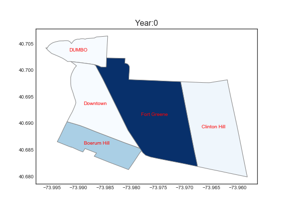

# Lab for Applied Data Science
## Author: Xiao(Robin) Jing
This repository contains the Python jupyter notebook for Statistics Modeling including multi-linear regression, Lasso Regression, PCA, TIme series(ARMA), Markov Process, clustering( Random Forest...) Logistic Regression etc..

### HW4 Markov Process & Time Series
1. Data Wrangling
> I use the data from ZillowNeighborhoodsNY.shp shapefile document and read with Geopandas.
> I choose the specific 5 neighbourhoods.

2. Simple visualization

+ Caption: From the plot, we found that with a given possibility distribution of people moving to another neighbourhood  from the previous one, no matter the initial population distribution, the final distribution keep the same.

2. Time series
Use the Global Individual Household Electricity data.
> observe the trend by ploting lag_plot
> fit the AR model
